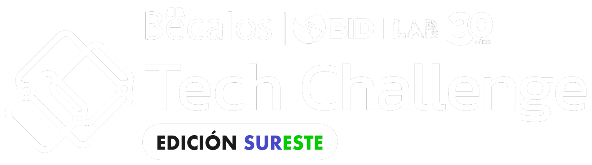

# Practicas de campus DEVF

Este repositorio son las practivas que se hicieron a cabo en el DEFV "Front-End".
Una escuela de Code donde se aprendierón todas las herramientas necesarias para crear un sitio web desde cero.

Dar click [aqui](./index.html) para ver los proyecto y ejercicios

Esto fue posible gracias a una beca por Becalos.

